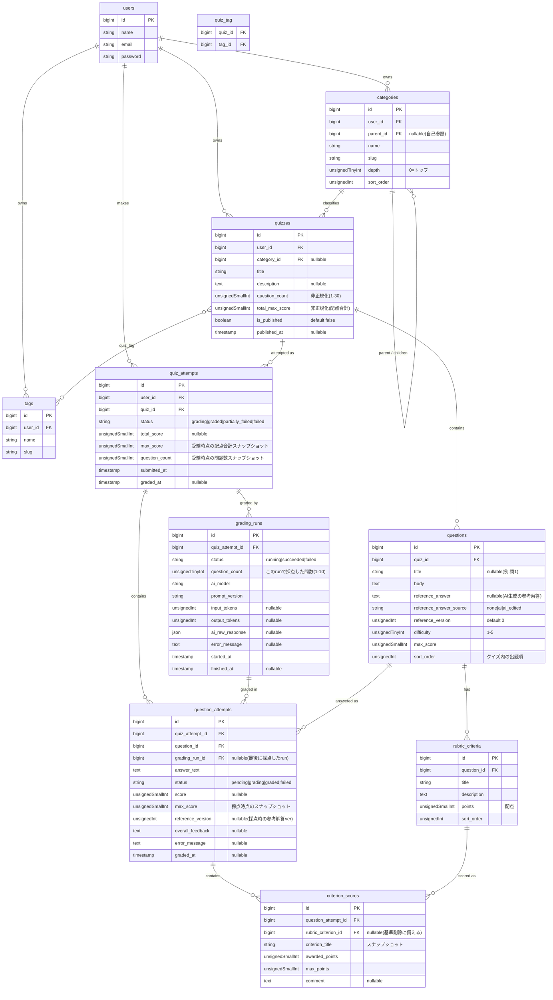

# 02. DB設計（v1）

## 0. エンティティの階層

```
User
 └─ Quiz（問題セット。1〜30問。カテゴリ・タグはここに付く）
     └─ Question（記述式の1問。模範解答を持つ）
         └─ RubricCriterion（採点観点 + 配点）

User が Quiz に挑戦する
 └─ QuizAttempt（1回の受験。合計点）
     ├─ QuestionAttempt（各問の回答 + 採点結果）
     │   └─ CriterionScore（観点ごとの部分点スナップショット）
     └─ GradingRun（採点API 1コール分。最大10問をまとめて採点。モデル/トークン/生レスポンス）
```

**採点の呼び出し単位**: 1コール = 最大10問（`GRADING_CHUNK_SIZE`、既定10）。
30問のクイズなら 3コールに分割し、キューで並列実行する。
API のトークン使用量・生レスポンスは問単位ではなく **GradingRun 単位** で記録する。

## 1. ER図



## 2. テーブル定義

### users
Breeze 標準のまま。追加カラムなし。

### categories
| カラム | 型 | 制約 / 備考 |
|---|---|---|
| id | bigint | PK |
| user_id | bigint | FK users, cascade delete |
| parent_id | bigint nullable | FK categories（自己参照）, cascade delete。null = トップレベル |
| name | string(100) | |
| slug | string(120) | `unique(user_id, parent_id, slug)`（兄弟間で一意） |
| depth | unsignedTinyInt | 0 起点。保存時に親の depth + 1 を計算 |
| sort_order | unsignedInt | 同じ親の中での表示順 |
| timestamps | | |

インデックス: `(user_id, parent_id, sort_order)`

**階層まわりのルール（アプリ側で担保）**
- 方式は **隣接リスト（`parent_id`）**。v1 の規模ではこれで十分
- **最大深さ 3 階層**（`depth <= 2`）に制限。例: `IT資格 > 基本情報 > アルゴリズム`
- 循環禁止: 親を付け替えるとき、自分自身や自分の子孫を親に指定できない
- 親カテゴリでクイズを絞り込むときは、**その配下の全子孫カテゴリのクイズを含める**
- 再帰クエリが必要なら `staudenmeir/laravel-adjacency-list` の導入を検討（v1 は深さ3固定なので素の Eloquent でも可）

### tags
`user_id`, `name`, `slug`, `unique(user_id, slug)`。タグは**階層なしのフラット**（カテゴリと役割を分ける）。

### quizzes
| カラム | 型 | 制約 / 備考 |
|---|---|---|
| id | bigint | PK |
| user_id | bigint | FK users, cascade delete |
| category_id | bigint nullable | FK categories, null on delete。**どの階層のカテゴリでも指定可** |
| title | string(200) | |
| description | text nullable | クイズの説明・出題範囲メモ（Markdown 可） |
| question_count | unsignedSmallInt | 非正規化。子 `questions` の件数。一覧表示・件数チェック用 |
| total_max_score | unsignedSmallInt | 非正規化。子 `questions.max_score` の合計 |
| is_published | boolean | default false |
| published_at | timestamp nullable | |
| timestamps | | |

インデックス: `(user_id, is_published)`, `(user_id, category_id)`

**クイズの問題数ルール（アプリ側で担保）**
- 1クイズは **1〜30問**。`questions` 追加時に 30 を超えさせない。削除で 0 にはできない
- クイズ作成は「最初の1問」とセット（0問のクイズは存在しない）
- `question_count` / `total_max_score` は問題の追加・削除・編集のたびに再計算（モデルイベント or サービス層）

### quiz_tag（中間テーブル）
`quiz_id`, `tag_id`、複合PK。タイムスタンプなし。

### questions
| カラム | 型 | 制約 / 備考 |
|---|---|---|
| id | bigint | PK |
| quiz_id | bigint | FK quizzes, cascade delete。**1問は必ず1クイズに属する** |
| title | string(200) nullable | 任意。未設定なら「問{sort_order}」で表示 |
| body | text | 問題文（Markdown 可） |
| reference_answer | text nullable | **AI が生成した参考解答**。ユーザーは手書きしない。採点では「一例」としてのみ渡す |
| reference_answer_source | string(10) | `none`（未生成）/ `ai`（AI生成のまま）/ `ai_edited`（ユーザーが手直し） |
| reference_version | unsignedInt | default 0。参考解答を生成・再生成・編集するたびに +1。受験結果の比較用 |
| difficulty | unsignedTinyInt | 1〜5、default 3。問題単位（1クイズ内に難易度が混在してよい） |
| max_score | unsignedSmallInt | この問題の満点。ルーブリック配点合計と一致（バリデーション） |
| sort_order | unsignedInt | クイズ内の出題順 |
| timestamps | | |

インデックス: `(quiz_id, sort_order)`

> `user_id` は持たない（`question->quiz->user_id` で辿る）。Policy もクイズ経由でスコープする。
>
> **模範解答カラムは持たない。** 採点の基準はあくまで `rubric_criteria`。`reference_answer` は
> フィードバックの質を上げるための補助で、点数計算には使わせない（プロンプトで明示）。

### rubric_criteria
| カラム | 型 | 備考 |
|---|---|---|
| id | bigint | PK |
| question_id | bigint | FK questions, cascade delete |
| title | string(150) | 観点名（例: 「用語の正確さ」） |
| description | text | 「何が書けていれば加点か」を具体的に |
| points | unsignedSmallInt | この観点の配点 |
| sort_order | unsignedInt | 表示順 |
| timestamps | | |

制約: 1問あたり 1〜10 件程度。`SUM(points) == questions.max_score` をアプリ側で検証。

### quiz_attempts
| カラム | 型 | 備考 |
|---|---|---|
| id | bigint | PK |
| user_id | bigint | FK users, cascade delete |
| quiz_id | bigint | FK quizzes, cascade delete |
| status | string(20) | `grading` → `graded` / `partially_failed` / `failed` |
| total_score | unsignedSmallInt nullable | 全問採点完了後、子 `question_attempts.score` の合計 |
| max_score | unsignedSmallInt | 受験時点の `quizzes.total_max_score` を複製 |
| question_count | unsignedSmallInt | 受験時点の問題数を複製 |
| submitted_at | timestamp | 全問を提出した時刻（= レコード作成時刻） |
| graded_at | timestamp nullable | 全問の採点が終わった時刻 |
| timestamps | | |

インデックス: `(user_id, submitted_at)`, `(quiz_id, status)`

> v1 は **1回の提出で全問まとめて送る**（途中保存なし）。`quiz_attempts` は提出時に作成し、
> 同時に全問の `question_attempts` を `pending` で作る。`partially_failed` は「一部の問だけ採点失敗」。

### question_attempts
| カラム | 型 | 備考 |
|---|---|---|
| id | bigint | PK |
| quiz_attempt_id | bigint | FK quiz_attempts, cascade delete |
| question_id | bigint | FK questions, cascade delete |
| grading_run_id | bigint nullable | FK grading_runs, null on delete。**最後にこの問を採点した run** |
| answer_text | text | 提出された記述回答 |
| status | string(20) | `pending` → `grading` → `graded` / `failed` |
| score | unsignedSmallInt nullable | 採点後に確定（`criterion_scores.awarded_points` の合計） |
| max_score | unsignedSmallInt | 採点時点の `questions.max_score` を複製 |
| reference_version | unsignedInt nullable | 採点時に渡した参考解答のバージョン（未使用なら null） |
| overall_feedback | text nullable | その問の総評 |
| error_message | text nullable | 採点失敗理由 |
| graded_at | timestamp nullable | |
| timestamps | | |

インデックス: `(quiz_attempt_id)`, `(question_id, status)`, `(grading_run_id)`
一意制約: `unique(quiz_attempt_id, question_id)`（1受験につき1問1回答）

### grading_runs
採点 API の1コール分。最大10問をまとめて採点した結果のメタ情報。

| カラム | 型 | 備考 |
|---|---|---|
| id | bigint | PK |
| quiz_attempt_id | bigint | FK quiz_attempts, cascade delete |
| status | string(20) | `running` → `succeeded` / `failed` |
| question_count | unsignedTinyInt | この run で採点した問数（1〜`GRADING_CHUNK_SIZE`） |
| ai_model | string(50) | 例: `claude-sonnet-5` |
| prompt_version | string(20) | 例: `v1` |
| input_tokens / output_tokens | unsignedInt nullable | コスト集計はこのテーブルを SUM |
| ai_raw_response | json nullable | デバッグ・再採点用に構造化レスポンス全体を保存 |
| error_message | text nullable | コール失敗理由 |
| started_at / finished_at | timestamp | finished は nullable |
| timestamps | | |

インデックス: `(quiz_attempt_id)`

> 初回採点では「30問 → 10問ずつ3 run」。再採点は失敗した問だけを集めて新しい run を作る
> （1問だけの run になることもある）。`question_attempts.grading_run_id` は最新の run を指す。

### criterion_scores
| カラム | 型 | 備考 |
|---|---|---|
| id | bigint | PK |
| question_attempt_id | bigint | FK question_attempts, cascade delete |
| rubric_criterion_id | bigint nullable | FK rubric_criteria, null on delete |
| criterion_title | string(150) | 採点時点の観点名スナップショット |
| awarded_points | unsignedSmallInt | 獲得部分点 |
| max_points | unsignedSmallInt | 採点時点の配点 |
| comment | text nullable | その観点についての AI コメント |

## 3. 設計上の判断メモ

- **クイズを最上位の単位にする**: カテゴリ・タグ・公開フラグは `quizzes` に付く。受験・採点・履歴・成績もすべてクイズ単位。
  `questions` は必ずどこかの `quiz` に属し、単体では存在しない（`quiz_id` は NOT NULL）。
- **問題数 1〜30 の担保はアプリ側**: DB の CHECK ではなく FormRequest / サービス層で検証（SQLite の CHECK 制約は扱いづらい）。
  `quizzes.question_count` を非正規化で持ち、一覧や上限チェックで毎回 COUNT しない。
- **スナップショット方針**: `quiz_attempts.max_score / question_count`、`question_attempts.max_score`、
  `criterion_scores.criterion_title / max_points` は受験・採点時の値を複製する。
  後からクイズや問題を編集しても、過去の受験結果の意味が変わらないようにするため。
- **模範解答は持たず、ルーブリックが採点の絶対基準**: このアプリは「記憶の定着度を測る」もの。ユーザーが
  記憶違いの模範解答を登録すると採点が汚染されるため、手書きの模範解答カラムは作らない。
  `reference_answer` は AI 生成の解答例で、採点では「表現の一例」としてのみ渡し、点数計算には使わせない（プロンプトで明示）。
  一度生成したら問題に保存して固定し、`reference_version` で受験結果の比較可能性を保つ。
- **採点は最大10問チャンク**: 1コールで最大 `GRADING_CHUNK_SIZE`（既定10）問を採点。30問なら 3 run に分けてキュー並列。
  呼び出し回数を抑えつつ、1コールの出力長・失敗の巻き込み範囲を10問に限定する。
  チャンク内でも「各回答はそのルーブリックのみで独立採点。他の回答と比較しない」とプロンプトで明示（相対評価の抑止）。
- **採点メタは `grading_runs` に集約**: モデル名・プロンプトバージョン・トークン・生レスポンスは問単位ではなく run 単位。
  問単位に持つと10問ぶん重複するし、コスト集計は run を SUM すれば済む。
- **3段の採点ステータス**: run（コール成否）→ question_attempt（問ごとの採点結果）→ quiz_attempt（全問集約）。
  ある run が `failed` ならその run の問だけ `failed`。全 question_attempt が `graded` になったら quiz_attempt を `graded`、
  一部残れば `partially_failed`。再採点は失敗問だけ新 run。
- **`total_score` は集計で出す**: AI に合計を計算させない。`question_attempts.score` を SUM、
  各 `question_attempts.score` も `criterion_scores.awarded_points` の SUM。
- **`grading_runs.ai_raw_response` を持つ理由**: v2 のプロンプト改善（eval）で「同じ回答を新プロンプトで採点し直す」ときに使う。
- **カテゴリの階層は隣接リスト（`parent_id`）**: nested set / closure table は更新が複雑。v1 は深さ 3 固定なので
  子孫の取得は「再帰 2 段」または `whereIn` で十分。問題になったら v2 で closure table 化。
- **`depth` を非正規化で持つ理由**: 深さ制限のバリデーションと階層表示（インデント）を JOIN なしで出せる。
  親を付け替えたら自分と全子孫の `depth` を再計算する。
- **削除の連鎖**: ユーザー削除で全データ cascade。クイズ削除で questions / quiz_attempts も消える
  （v1 は個人用なので割り切り。v2 で soft delete 検討）。カテゴリ削除は子孫ごと cascade、
  紐づく `quizzes.category_id` は null になる。

## 4. シーダー方針

- テストユーザー1名
- カテゴリを**階層構造で**投入。例:
  - `IT資格` > `基本情報` > (`アルゴリズム`, `データベース`), `応用情報`
  - `英語` > (`語彙`, `英作文`)
  - `歴史`（子なし）
- タグ数件（フラット）
- サンプルクイズ 3〜5件（中間・末端カテゴリの両方に割り当て、`is_published = true`）
  - 問題数はバラす: 「1問だけのクイズ」「5問前後」「11問以上（採点が2チャンクに分かれる境界確認用）」を混ぜる
  - 各問に 2〜4 観点のルーブリック（観点説明を具体的に）
  - `reference_answer` は一部の問だけ埋める（`ai` 相当のダミー文）。残りは `none` のまま生成挙動を手で確認
- quiz_attempts / question_attempts / grading_runs はシードしない（手動で挙動確認）
